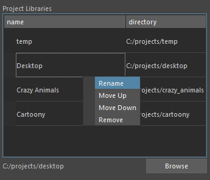
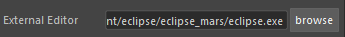

Paths
-----

Project Tab
^^^^^^^^^^^

Here live the different projects you may be working on.
Set a project by clicking the Browse button at the bottom of the list.

    In the right click menu you can name the project, move it up or down in priority, or remove it from the list.

.. rubric:: External Editor

If you set this to the .exe file of a code editor you can load code in the code tab by right clicking: open in external.

.. note::

    This only works with external editors that take a text file as an argument when running the .exe in command line.
    Eclipse IDE is one example that works.
    
Code Tab
^^^^^^^^

Here you can set additional directories to source from.  Directories should have a python package or python module inside.

.. note::
    A python package is a folder with a file named __init__.py inside. __init__.py can be an empty file.
    A python module is a name.py file.

Hit the browse button to select a directory.    
Directories added here will have their packages and modules available during the build process. They will be available for import.
In the right click menu you can remove python packages.