Curves
======
 
The names of these curves can be used when calling a rig class to set the curve shape.

.. code-block:: python

    from vtool.maya_lib import rigs
 
    rig = rigs.FkRig("test", "C")
    rig.set_control_shape("square")
 
-----------------------------
 
.. rubric:: Curves with no example image
 
.. rubric:: square_locator
 
.. rubric:: pin_four_corner
 
.. rubric:: circle_arrow
 
.. rubric:: arc
 
.. rubric:: octogon
 
.. rubric:: cube_locator
 
.. rubric:: simple_sphere
 
.. rubric:: circle_corner
 
.. rubric:: cube_point
 
.. rubric:: pill
 
.. rubric:: cylinder
 
.. rubric:: lift
 
.. rubric:: back_arc
 
-----------------------------
 
.. rubric:: Curves with example image
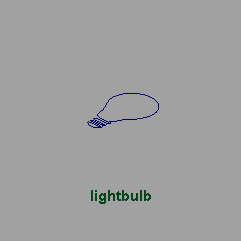
 
    lightbulb
 
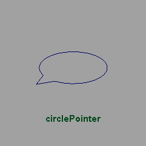
 
    circlePointer
 
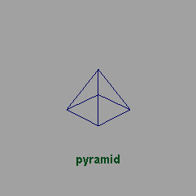
 
    pyramid
 
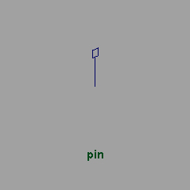
 
    pin
 
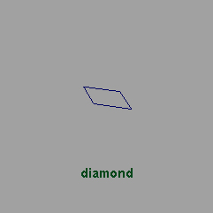
 
    diamond
 
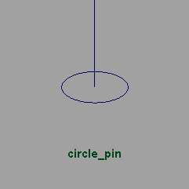
 
    circle_pin
 
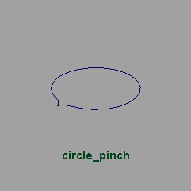
 
    circle_pinch
 
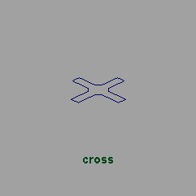
 
    cross
 
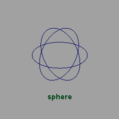
 
    sphere
 
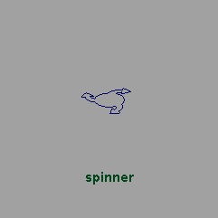
 
    spinner
 
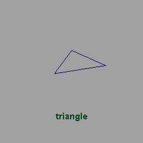
 
    triangle
 
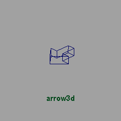
 
    arrow3d
 
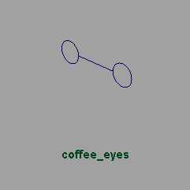
 
    coffee_eyes
 
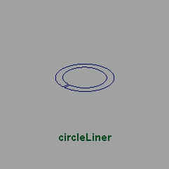
 
    circleLiner
 
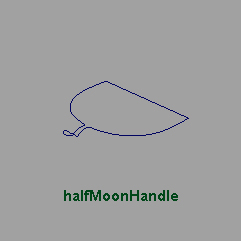
 
    halfMoonHandle
 
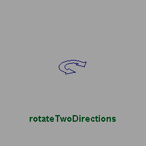
 
    rotateTwoDirections
 
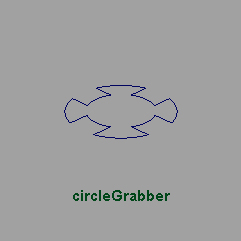
 
    circleGrabber
 
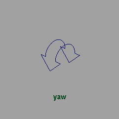
 
    yaw
 
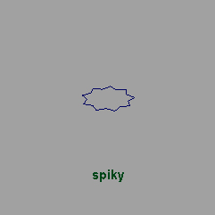
 
    spiky
 
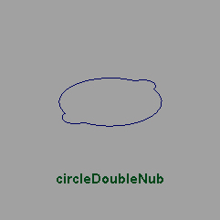
 
    circleDoubleNub
 
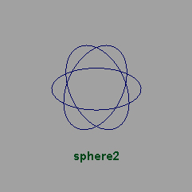
 
    sphere2
 
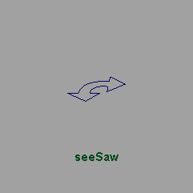
 
    seeSaw
 
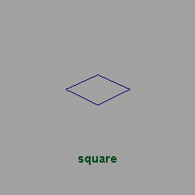
 
    square
 

 
    inOut
 
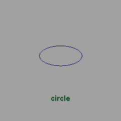
 
    circle
 
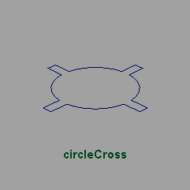
 
    circleCross
 
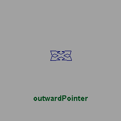
 
    outwardPointer
 
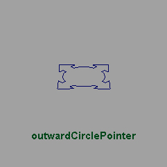
 
    outwardCirclePointer
 
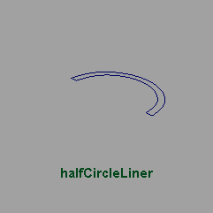
 
    halfCircleLiner
 
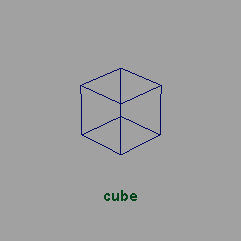
 
    cube
 
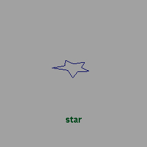
 
    star
 
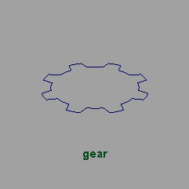
 
    gear
 
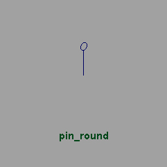
 
    pin_round
 
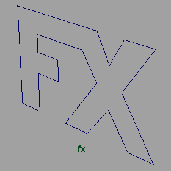
 
    fx
 
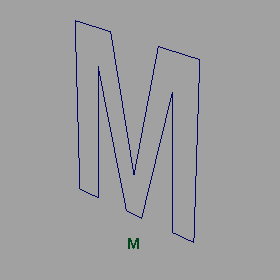
 
    M
 
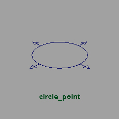
 
    circle_point
 
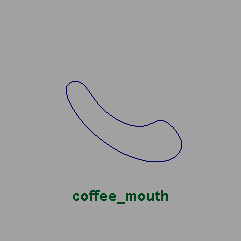
 
    coffee_mouth
 
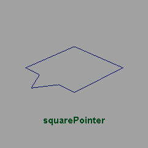
 
    squarePointer
 
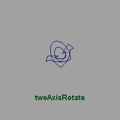
 
    twoAxisRotate
 
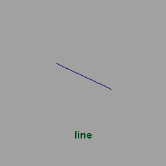
 
    line
 
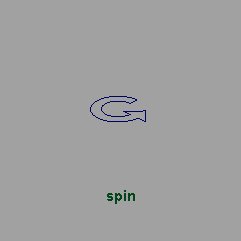
 
    spin
 
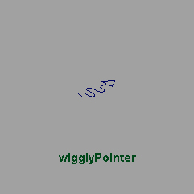
 
    wigglyPointer
 
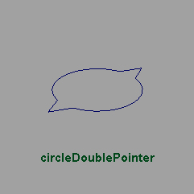
 
    circleDoublePointer
 
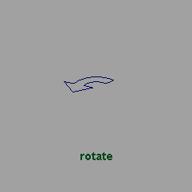
 
    rotate
 
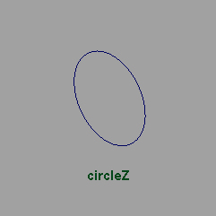
 
    circleZ
 
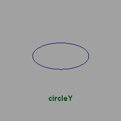
 
    circleY
 
.. figure:: curve_images/circleX.jpg
 
    circleX
 
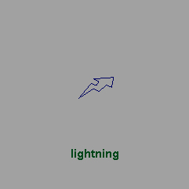
 
    lightning
 
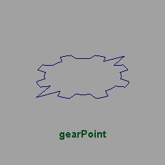
 
    gearPoint
 
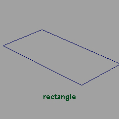
 
    rectangle
 
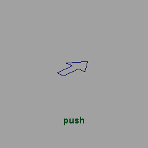
 
    push
 
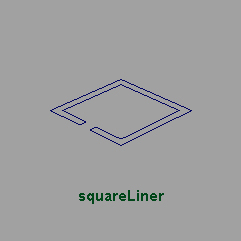
 
    squareLiner
 

 
    circleNub
 

 
    pin_point
 

 
    square_point
 

 
    glasses
 
