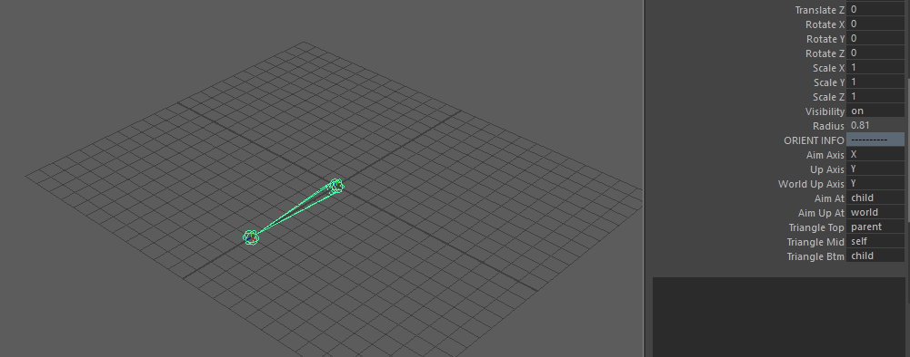
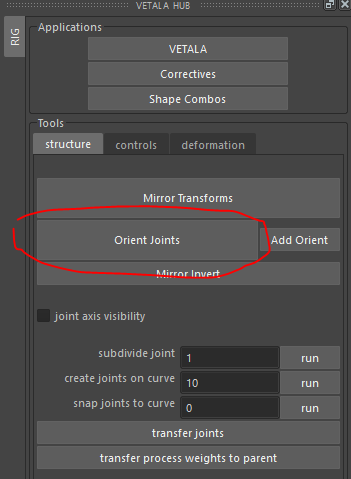
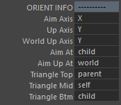

Joint Orient Intro
------------------

Structure files will often use joints with orientation info built in.

ORIENT INFO
===========

Orient Joints Button
====================

Use the Orient Joints button to orient all joints that have the ORIENT INFO attributes. The small **Add Orient** button can be used to add the attributes to any selected joint.

ORIENT INFO settings
====================

Joints have an orientation.  Their X, Y and Z axis point a certain way depending on that orientation.
These settings let you define which way the joint is pointing.  
This can be important to achieve certain effects for animators.

Aim Axis
^^^^^^^^

The axis of aim. 
This tells the orientation which direction it should point.
Options include X,Y,Z,-X,-Y,-Z.  The negative axis flips to the opposite direction.

Up Axis
^^^^^^^

The axis that points up. 
Options include X,Y,Z,-X,-Y,-Z.  The negative axis flips to the opposite direction.

World Up Axis
^^^^^^^^^^^^^

This tells the joint what world it lives in.  Most of the time the joint lives in a world where Y points up.
However sometimes it can help if the world up axis points in Z or X, especially if a joint is more comfortable with those alignments.

Aim At
^^^^^^

This tells the joint what its Aim Axis should aim at. 
    :world_X: Aim in world X direction.
    :world_Y: Aim in world Y direction.
    :world_Z: Aim in world Z direction.
    :child: This tells the joint to aim at its first child.
    :parent: This tells the joint to aim at its parent.
    :local_parent: This tells the joint to aim at a local parent.  Which is like aiming at parent, but with a negative aim axis.

Aim Up At
^^^^^^^^^

This tells the aim up what space it lives in or what it should aim up at. It tries its best, but AimAt has priority.
    :world: Aim up at the world.
    :parent_rotate:  Aim up in the same space as the parent.
    :child_position: The up axis will try its best to point at the child.
    :parent_position: The up axis will try its best to point at the parent.
    :triangle_plane:  This is the most advanced up. It will create a triangle from Triangle Top, Triangle Mid and Triangle Btm and try to point the up in the same direction that the Triangle Mid points.

Triangle Top, Mid and Btm
^^^^^^^^^^^^^^^^^^^^^^^^^

This lets you set what Aim Up At - triangle_plane uses to construct its triangle. The position in space will be used for each corner of the triangle.
	:grand_parent: From the current joint, go up the hierachy twice.
	:parent: From the current joint, go up the hierarchy once.
	:self: Use the current joint.
	:child: From the current joint, go down the hierarchy once.
	:grand_child: From the current joint, go down the hierarchy twice.
    