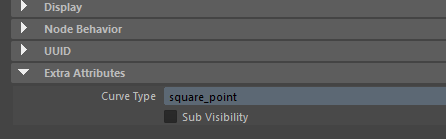

Correctives Intro
-----------------

This tool helps with the creation of pose deformation on a mesh.  It creates poses which interface between the rig and the deformed mesh. Poses activate blendshapes in the deformation stack. Multiple meshes can be added to one pose.

.. Note::
    
    Before creating a pose make sure to move your character's controls into position first. 

Correctives UI
==============

Below we will discuss the Default Pose buttons, the Corrective Pallet, and filter names.

.. figure:: images/main_window.PNG
    
    The Correctives UI

Default Pose
============
    
.. rubric:: To Default Pose

This Button brings the character to the default pose. You must save a default pose using Set Default Pose Button.

.. Note::
    
    The default pose is always set to what is stored after importing pose data.  You will want to make sure that the default pose is the default pose of your character for animation. If you are turning on FK for arms and legs, make sure the default pose sets them back to IK... if IK is your default. 

.. rubric:: Set Default Pose

This Button stores out control values to a DATA variable on the pose_gr.   

.. Note::
    
    Controls must be named with prefix CNT or have a string attribute ctrlType to be recognized by this tool.
    

    curveType string attribute must be on a control in order for it to be recognized by the Correctives tool.
    
Correctives Pallet
==================

By default the Correctives pallet is blank. For options you have to right click on the pallet.

.. figure:: images/right_click.PNG

    The right click menu of the pallet.
    
.. rubric:: New Group

This will create a new empty pose group that poses can be parented under.

.. rubric:: New Cone

This will create a cone pose group.  This reads the angle of the joint.  

.. Note::

    You must have at least one joint selected for a cone to be created.
    
.. rubric:: No Reader

This will create a new no reader pose group.  They are called "no reader" because the pose does not by default read the rig.  You must define how this pose attaches to the rig.

.. rubric:: New Timeline

This creates a pose that reads the timeline. The position on the timeline gets stored to the pose. 

.. rubric:: Refresh

This refreshes the list of poses.

Filter Names
============

By entering a string in filter names widget, you can change what shows up in the pallet.  If you write "arm", only poses with arm in the name will show up in the pallet. 

.. Note::

    This only filters top level poses.  Poses parented under a top level pose will not get filtered. 

   