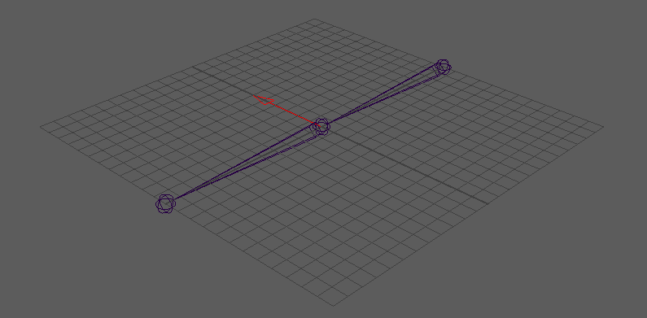
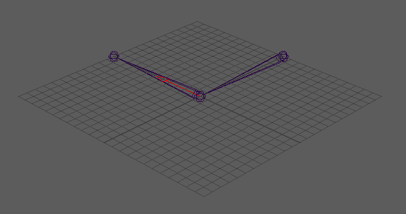

Pose Cone
---------

The pose cone is a pose that reads the angle of a joint in the rig.  It has a 0 to 1 weight value that connects into a blendshape on the mesh. By right clicking in the ui while a joint is selected you can create a pose cone.  This will create a red arrow on the selected joint that points in the direction of the pose.

    The red arrow is a pose cone.

    When the joint and the red arrow line up, the pose weight is 1.  The further the joint gets away from the red arrow the more the weight value goes down, until it reaches 0.
    
Pose Cone UI
============

.. figure:: images/cone_pose_ui.PNG

    The pose cone menu.
    

.. rubric:: Parent

In this case the pose is on the elbow. The parent automatically gets set to the arm joint, which is the parent of the elbow joint.  You can change the parent by typing the name of another transform.
    
.. rubric:: Alignment Dropdown

This is the axis that the joint being used for the pose has.  If the X axis is pointing down the joint, set Alignment to X.  If the Y axis is pointing down the joint, then Y. If the Z axis is pointing down the joint then Z.
    
.. Note::

    You may have cases where the arrow points the exact opposite of the direction where the joint is aligned.  This happens when the axis pointing down the joint, points away from the child joint.  This has no effect on the angle calculation, and is just a visual bug.
    
.. rubric:: Max Angle

This sets the widest angle that a joint get away from a pose before turning off.   At 90 the pose turns off when the joint is 90 degrees away from the pose.  If you set it to 45 then the pose turns off when the joint is 45 degrees away from the pose. 
    
.. rubric:: Max Twist

The axis that points down the joint is the axis of twist.  With a Max Twist of 90, the joint can twist on this axis 90 degrees before the pose turns off. This twist amount is multiplied by the Max Angle.

.. rubric:: Max Distance

The distance the joint can travel away from the pose before the weight turns to 0.  This is good for scapula correctives on a quadruped, where the scapula bone slides on the body. 

.. rubric:: Twist

This value turns off the effect of Max Twist.  If the Twist is set to 0, then twisting the joint will not turn off the pose.  If the Twist is set to 1, then the pose will turn off when the joint rotates on axis the amount of Max Twist.