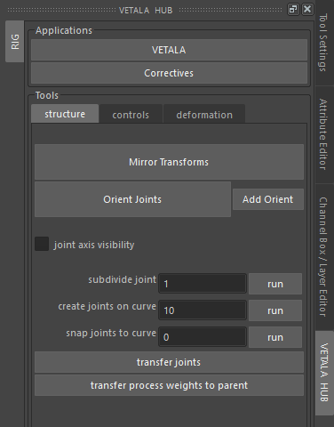
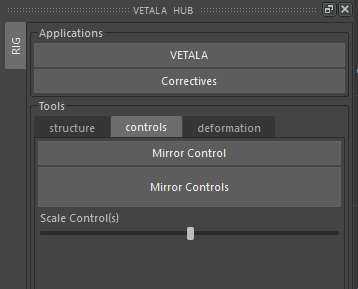
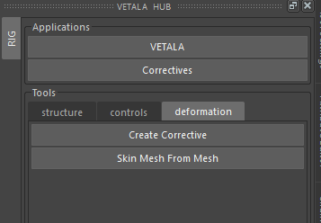

UI Hub
------

    
    The Vetala Hub structure tab.

.. rubric:: Vetala Button

This launches Vetala UI.

.. rubric:: Correctives

This launches the Correctives UI

structure tab
=============

.. rubric:: Mirror Transforms

Mirrors transform positions from left to right. Finds right side by replacing _L with _R, or lf with rt.

.. note::

    Mirrors all transforms in the scene. 
    Be careful to use it only on your strucutre file and not finished rigs.

.. rubric:: Orient Joints

Orient the joints that have orientation attributes.
Rig templates with structure data should come with joint orient attributes already setup.

.. rubric:: Add Orient

Add orient attributes to joints. You need to set the orient attributes to work for your joint chain.

.. rubric:: joint axis visibility

Toggles the visibility of joint orientation in the scene. This is useful for checking joint orientation. 

.. rubric:: subdivide joint

Select a parent and child joint in the scene. Hit run to add joints inbetween the parent and child. You can set the number of joints you want to add inbetween.

.. rubric:: create joints on curve

Select a curve in the scene. Hit run to add joints along the curve. You can edit the number of joints you want to add to the curve.

.. rubric:: snap joints to curve

Select a curve and joints. Hit run to have the joints snap to the curve. If the number is more than the amount of joints selected, new joints will be added.

.. rubric:: transfer joints

Select a source mesh and a destination mesh. Source and destination meshes must have the same point order. 
Joints with prefix joint will move from their position on source mesh to a corresponding position on destination mesh.

controls tab
============

    
    The Vetala Hub controls tab.
    
.. rubric:: Mirror Control

Mirror a single control from left to right.  This mirrors control cv positions.

.. rubric:: Mirror Controls

Mirror all controls left to right. If one control is selected it will only mirror that control.

.. rubric:: Scale Control(s)

Scale selected controls by manipulating the slider.

deformation tab
===============

    
    The Vetala Hub deformation tab.

.. rubric:: Create Corrective

Select a fix shape and your skinned mesh. This will create the delta to blendshape in before the skin cluster.

.. rubric:: Skin Mesh From Mesh

Select a skin weighted mesh and an a mesh with no skin deformer.  It will add the joints from the skinned mesh and copy weights.